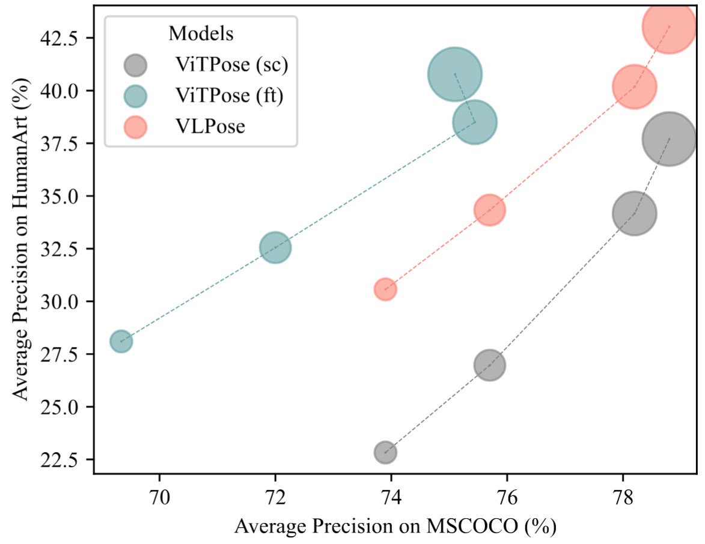
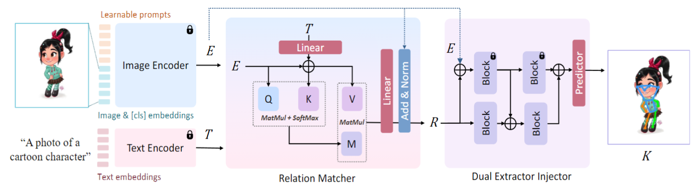
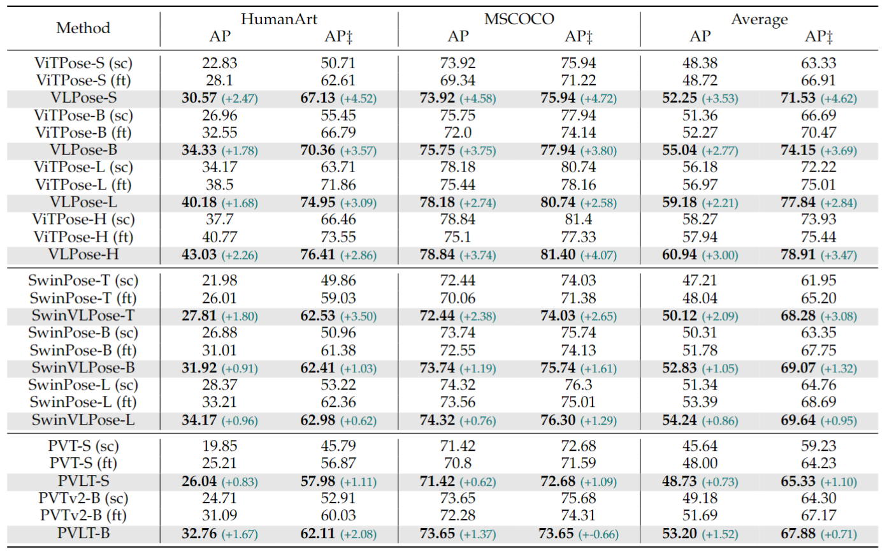

# VLPose: Bridging the Domain Gap in Pose Estimation with Language-Vision Tuning

<div style="text-align:center">
  
</div>

## Framework



## Performance



## RUN
### Installation
Please refer to [installation.md](https://mmpose.readthedocs.io/en/latest/installation.html) for more detailed installation and dataset preparation.

### Train 
- Pretrained configs: `configs/_ours_/coco/pretrain/cvl` 
- Post-trained configs: `configs/_ours_/humanart/pretrain/cvl`

```bash
# Train with single GPU
python tools/train.py ${CONFIG_FILE} --work-dir ${WORK_DIR}
# Train with multi GPUS
bash ./tools/dist_train.sh ${CONFIG_FILE} ${GPU_NUM} --work-dir ${WORK_DIR}
```

### Test
You can get our trained models [here](https://drive.google.com/drive/folders/1lScxMdoFy72qYTH9hfU-yJ9GUitQf_Rp).
Their corresponding configs are from `configs/_ours_/humanart/pretrain/cvl`:
- `first_amiddle_last_add_concat_attn_blip-B_kw1_vit-B_dp20.py`  
- `first_amiddle_last_add_concat_attn_blip-B_kw1_vit-B_sp20.py`
- `first_amiddle_last_add_concat_attn_blip-B_kw1_vit-H_dp5.py`
- `first_amiddle_last_add_concat_attn_blip-B_kw1_vit-H_sp5.py`
- `first_amiddle_last_add_concat_attn_blip-B_kw1_vit-L_dp10.py`
- `first_amiddle_last_add_concat_attn_blip-B_kw1_vit-L_sp10.py`
- `first_amiddle_last_add_concat_attn_blip-B_kw1_vit-S_dp50.py`
- `first_amiddle_last_add_concat_attn_blip-B_kw1_vit-S_sp50.py`

```bash
# Test with single GPU
python tools/test.py ${CONFIG_FILE} ${CHECKPOINT_FILE} --work-dir ${WORK_DIR}
# Test with multi GPUs
bash ./tools/dist_test.sh ${CONFIG_FILE} ${CHECKPOINT_FILE} ${GPU_NUM}  --work-dir ${WORK_DIR}
```

## Citation
If you find this project useful in your research, please consider cite:
```
@misc{li2024vlposebridgingdomaingap,
  title={VLPose: Bridging the Domain Gap in Pose Estimation with Language-Vision Tuning}, 
  author={Jingyao Li and Pengguang Chen and Xuan Ju and Hong Xu and Jiaya Jia},
  year={2024},
  eprint={2402.14456},
  archivePrefix={arXiv},
  primaryClass={cs.CV},
  url={https://arxiv.org/abs/2402.14456}, 
}
```